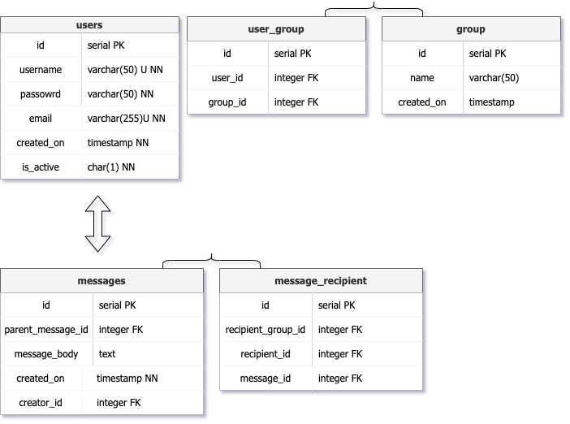

## Mack
 
<em>It's like slack but shittier</em>
 

### What Purpose Does Mack Serve?
Not much if im being honest. I used this project to learn TypeScript, WebSockets, and improve my SQL queries.

### Will I finish This Project?
Ha... Oh god I hope so. I started this project sometime in April and its currently July. I have been so busy with work and looking for another position I sort of forgot about it. BUT I WILL PREVAIL.

### How To Run
(It's a mess but i'm too lazy to fix it rn) 
Root: <code>run npm i</code> 
FrontEnd: <code>run npm i</code>Then<code>run npm start</code> 
BackEnd: <code>run npm i</code>Then<code>run npm build</code>*run this first* 

### DB Diagram
